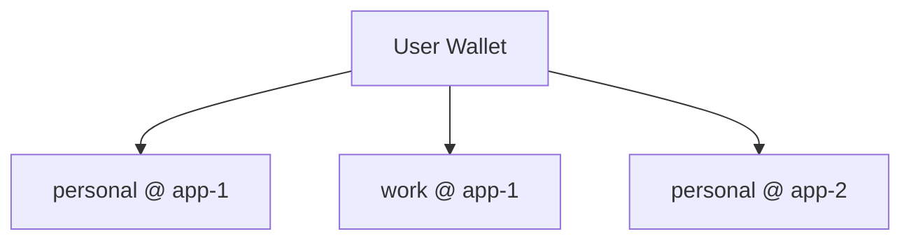

<!-- Mirrored from MystenLabs/MemWal/docs at dev. Do not edit this file here: edits are forwarded to MystenLabs/MemWal. -->
---
title: "Memory Space"
description: >-
  The isolated unit of storage in Walrus Memory. A memory space is uniquely identified by
  owner address, namespace, and app ID, ensuring full isolation between users, apps, and
  deployments.
keywords:
  - Walrus Memory
  - MemWal
  - memory space
  - namespace
  - app ID
  - isolation
  - scoping
goal:
  description: Use namespaces to scope agent memory within an account, prevent cross-namespace data leakage, and design a namespace strategy for multi-agent or multi-user deployments.
  requires:
    - has_frontmatter:
        - title
        - description
        - keywords
      label: Has required frontmatter fields
    - min_words: 300
      label: Needs more content depth
    - has_questions: true
      label: Needs questions for AI search visibility
    - has_answer: true
      label: Needs answer summary for AI citation
questions:
  - What is a memory space in Walrus Memory?
  - How are memories isolated between users and apps in MemWal?
  - What is a namespace in Walrus Memory?
answer: >-
  A memory space is the isolated unit of storage in Walrus Memory, uniquely identified by
  three values: the owner address (Sui wallet), a developer-defined namespace, and the app ID
  (Walrus Memory package ID). This triple ensures that no two memory spaces overlap, providing
  full isolation between users, applications, and deployments.
---

A **memory space** is the isolated unit of storage in Walrus Memory. Think of it as a folder or bucket for your memories — you choose which memory space to store into and which to retrieve from.

Each user can own as many memory spaces as they want.

## What defines a memory space?

Every memory space is uniquely identified by three values:

| Component | What it is |
|-----------|-----------|
| **Owner address** | The Sui wallet address that owns the memory |
| **Namespace** | A developer-defined label to group and organize memories |
| **App ID** | The Walrus Memory package ID (`MEMWAL_PACKAGE_ID`) — unique per relayer deployment |

Together, `owner + namespace + app_id` form the boundary — no two memory spaces can overlap.

## Namespace

A namespace is simply a name you give to group related memories. One user can have multiple namespaces to separate different kinds of data.

For example:
- `personal` — store personal preferences, notes, and context
- `work` — store work-related knowledge and conversations
- `research` — store research findings and references

Namespaces are set in the SDK when you create a client:

```ts
const memwal = MemWal.create({
  key: process.env.MEMWAL_PRIVATE_KEY!,
  accountId: process.env.MEMWAL_ACCOUNT_ID!,
  serverUrl: process.env.MEMWAL_SERVER_URL,
  namespace: "personal",
});
```

## App ID

The **app ID** is the Walrus Memory package ID deployed on Sui (`MEMWAL_PACKAGE_ID`). Each relayer deployment is tied to a single package ID, which is used for SEAL encryption key derivation and Walrus blob metadata.

Two separate Walrus Memory deployments can each have a user with a `personal` namespace, and their memories will never mix — because the app ID (package ID) is different. This means the vector database scopes queries by `owner + namespace`, while the encryption and blob discovery layer provides an additional isolation boundary through the package ID.

## How it works in practice



In this example, one user has three separate memory spaces:
- **personal** memories in **app-1**
- **work** memories in **app-1**
- **personal** memories in **app-2** (a completely different deployment)

Each is fully isolated — storing into one never affects the others, and recall only searches within the specified memory space.
